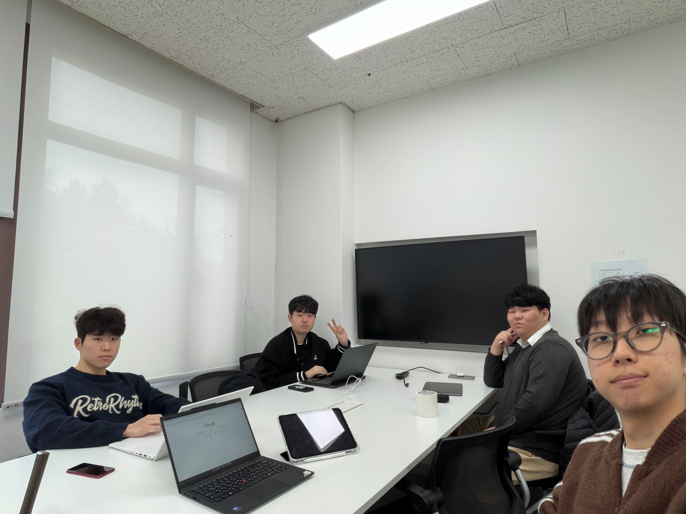

# 26.4.15 2주차 활동

## 📌 오늘 한 것
-중간고사 대비 전공시험 공부
--소프트웨어적 사고 python 기초문법
--소프트웨어 프로젝트1 리눅스 터널 명령어
--공학기초수학 부피, 삼각치환 학습 / 미적분 개념 복습

조원 활동내역

박준영 : 시험기간을 대비해 소프트웨어 프로젝트 수업에서 배운 리눅스 명령어를 직접 실습하였다.
이 과정에서 sudo 명령어를 통해 관리자 권한으로 시스템 명령을 수행할 수 있음을
이해하였고, 파일 경로를 지정하는 방식에서 상대경로와 절대경로의 차이를 구분하여
활용할 수 있게 되었다.

옥진수 : 시험기간을 대비해 소프트웨어적 사고 강의때 배운 메모리와 변수에 대해 찾아보고 공부함.
메모리에 변수들이 저장되는 방식, 참조횟수 같은 개념을 익힘. 인풋 아웃풋 강의때 배운
함수들을 직접 코드 입력해 시현해보고, 관련 백준 문제들을 풀며 시험대비 공부를 함.

장성준 : 중간고사를 대비하기 위하여 공학기초수학 1 과목을 중심으로 학습하는 시간을 가짐. 특히
본인이 어려워했던 부피 부분과 삼각치환 부분을 중심으로 학습하였음. 어려움을 극복하기
위해 직접 함수 그래프의 개형을 직접 그려가거나, 유사한 문제들을 찾아가며 개념을
이해하고자 노력함.

최승한 : 시험 기간인 점을 고려하여 기존에 진행하던 스터 디 내용을 잠시 멈추고 소프트웨어적 사고
강의에 서 배운 2 진수의 다양한 연산 밑 보수 개념 밑 필요성을 복습하고 리눅스의 폴더들
명칭과 역할, 명령어의 상세 옵션들을 공부함. 추가로 공학기초 수학에서 다룬 여러 미적분
개념을 복습하고 문제를 풀어봄.

## 📸 활동사진

